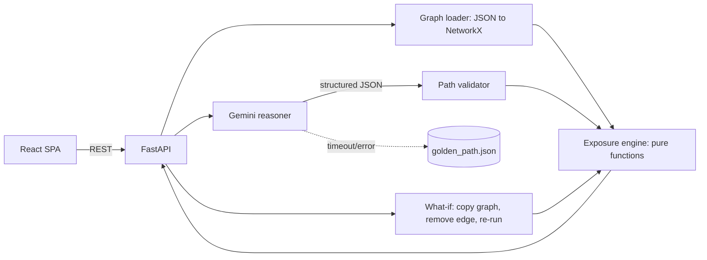

# TRD: Financial Attack Path Intelligence (FAPI)

| Field | Value |
|---|---|
| Author | Jaxz |
| Status | Draft |
| Version | 0.1 |
| Last updated | 18 Sep 2026 |
| Related PRD | PRD-financial-attack-path-intelligence.md |

## 1. Overview & scope

A single-container web app: a FastAPI backend that loads one synthetic bank graph from JSON, calls Gemini once for attack-path reasoning, validates that output against the graph, and runs a pure-function exposure engine. It serves a React SPA with four views. The TRD covers all Must/Should FRs (FR-1 to FR-10). FR-11 is a stretch goal and FR-12 is not built.

## 2. Architecture



| Component | Responsibility |
|---|---|
| Graph loader | Parse `bank.json` into a NetworkX DiGraph; schema-check on startup |
| Gemini reasoner | One structured-output call returning hops, a technique per hop, and a narrative. Falls back to the cache on failure |
| Path validator | Rejects any hop that is not an `allowed` edge; cross-checks `systems_reached` against a code BFS |
| Exposure engine | Pure functions from graph + validated paths to verdict + evidence. No I/O, no LLM |
| What-if | Applies a predefined mutation to a graph copy and re-runs code traversal + engine. **No Gemini call**, so it is instant and deterministic |
| React SPA | Verdict, Attack Path, Show Me Why, What-If |

**How the work is split:** code BFS is the ground truth for reachability. Gemini does what code can't: it reads free-text permission and evidence descriptions, names the technique at each hop, and writes the board narrative. If Gemini and BFS disagree, BFS wins and the mismatch is logged.

**Deployment:** one Docker image. FastAPI serves the built React bundle as static files, giving a single Cloud Run service with no CORS and no second host.

## 3. Tech stack & rationale

| Layer | Choice | Why | Alternative considered |
|---|---|---|---|
| Frontend | React + Vite + TypeScript + Tailwind | Fast build; known stack | Next.js (SSR not needed) |
| Graph viz | React Flow | Custom nodes and edge styling/animation for a 15-node graph | D3 (slower to build) |
| Backend | Python 3.12 + FastAPI + Pydantic | Matches the handoff; NetworkX and the Gemini SDK are first-class | Go (known, but graph/LLM libraries are thinner) |
| Graph | NetworkX | BFS and all-simple-paths in one line each | Hand-rolled |
| AI | Gemini via the `google-genai` SDK, structured output with a Pydantic schema | Mandatory; schema-enforced JSON | — |
| Storage | JSON files in the repo | 15 nodes, read-only | SQLite (no benefit) |
| Auth / cache / queue | None | Out of scope | — |
| Hosting | Google Cloud Run + Secret Manager | Mandatory | Firebase Hosting for the frontend (extra moving part) |

> ⚠️ Assumption: use whichever Gemini Flash model is current in AI Studio; confirm the model ID at build time.

## 4. Data model

All files live in `backend/data/` and are read-only at runtime.

| Entity | Key fields | Notes |
|---|---|---|
| Node | `node_id`, `type`, `name`, `criticality` (medium/high/critical), `critical_function` (bool), `transaction_limit_usd?`, `mttd_hours?`, `mttd_evidence?` | Limits and MTTD only on financial systems |
| Edge | `edge_id`, `source`, `destination`, `relationship`, `permission`, `allowed`, `description` (free text for Gemini), `control_bypass_probability?`, `evidence?` | Missing probability or evidence means UNKNOWN |
| Rules | `disruption_hours_by_criticality`, `materiality_threshold_usd`, `cyber_risk_rule` | `rules.json`, every rule has an ID |
| WhatIf | `change_id`, `label`, `op: remove_edge`, `edge_id`, `effort_hours` | Predefined only |
| AttackPath (Gemini output) | `entry_point`, `paths[].steps[]{from,to,technique,evidence_edge}`, `systems_reached`, `narrative` | Pydantic model = Gemini response schema |
| Verdict | `cyber_risk`, `financial_exposure_usd`, `disruption_hours`, `regulatory_status`, `complete` (bool), `per_system[]`, `evidence[]` | Each evidence row: `factor`, `value`, `source`, `rule_id` |

### Exposure rules (proposal; needs founder sign-off, PRD §8 Q1–5)

```
detection_gap(s)  = min(mttd_hours / 24, 1.0)       # share of the daily limit movable before detection
path_bypass(s)    = max over paths of the product of edge.control_bypass_probability
exposure(s)       = transaction_limit_usd × detection_gap × path_bypass
total exposure    = Σ exposure(s) over reached financial systems
disruption        = max over reached systems of the lookup {critical: 72, high: 24, medium: 8}
cyber_risk        = HIGH if any critical system is reached; MEDIUM if any high; else LOW
regulatory        = MATERIAL if (a critical_function system is reached AND total ≥ threshold) else BELOW
UNKNOWN factor    → use 1.0, mark the row UNKNOWN, set verdict.complete = false, UI shows "up to $X"
```

Worked demo numbers, which match the pitch deck:

| System | Limit | MTTD → gap | Bypass (e1 × eN) | Exposure |
|---|---|---|---|---|
| payments-core (critical) | $2,500,000 | 18h → 0.75 | 1.0 × 0.8 | $1,500,000 |
| refunds-api (high) | $2,000,000 | 12h → 0.50 | 1.0 × 0.8 | $800,000 |
| **Current total** | | | | **$2,300,000 / 72h / HIGH / MATERIAL** |
| **After revoking e2** (payments-core unreachable) | | | | **$800,000 / 24h / MEDIUM / BELOW** |

The story behind the data: the vendor legitimately needs `refund_write` (e3), while `payment_write` (e2) is the over-privilege. Avoided exposure = $1.5M for about 1 engineering hour.

## 5. API design

| Method | Path | Purpose | Auth | Maps to |
|---|---|---|---|---|
| GET | `/api/scenario` | Graph, scenario metadata, available what-ifs | None | FR-1 |
| POST | `/api/analyze` | Gemini path → validate → engine → verdict + evidence + narrative | None | FR-2–6 |
| POST | `/api/what-if` | `{change_id}` → `{before, after, avoided_usd, effort_hours, removed_edges}` | None | FR-7–9 |
| GET | `/healthz` | Cloud Run health check | None | NFR-4 |

```json
// POST /api/what-if  {"change_id": "revoke-payment-write"}
{
  "before": {"cyber_risk": "HIGH", "financial_exposure_usd": 2300000, "disruption_hours": 72, "regulatory_status": "MATERIAL"},
  "after":  {"cyber_risk": "MEDIUM", "financial_exposure_usd": 800000, "disruption_hours": 24, "regulatory_status": "BELOW"},
  "avoided_usd": 1500000, "effort_hours": 1, "removed_edges": ["e2"]
}
```

## 6. Technical requirements

| ID | Requirement | Implements | Notes |
|---|---|---|---|
| TR-1 | `bank.json` with 10–15 nodes, Pydantic-validated at startup | FR-1 | Fail fast on schema errors |
| TR-2 | Gemini call with `response_schema=AttackPath`, temperature 0, and a prompt that forbids inventing nodes, edges, or numbers | FR-2, NFR-1 | Graph sent **without** dollar fields |
| TR-3 | Validator: each step must be an existing edge with `allowed=true`; `systems_reached` must be a subset of BFS reachable nodes | FR-3 | On failure, fall back to the cache and log |
| TR-4 | Engine as pure functions in `engine/exposure.py`; rule IDs on every output row | FR-4, FR-5, NFR-1, NFR-2 | No network imports in this module |
| TR-5 | UNKNOWN handling per §4; `complete=false` propagates to the UI badge | FR-6 | |
| TR-6 | What-if: `deepcopy` the graph → `remove_edge` → BFS + engine; never calls Gemini | FR-7, NFR-3 | Technique labels reused from the first analysis |
| TR-7 | `avoided_usd = before − after`, computed server-side | FR-8 | |
| TR-8 | React Flow graph: path edges animated; `removed_edges` rendered dashed red | FR-9 | Fixed node positions in JSON, no auto-layout |
| TR-9 | 8 s timeout on Gemini, then serve `golden_path.json`; response carries `source: live\|cached` | FR-10, NFR-3 | Env `DEMO_MODE=cached` forces the cache |
| TR-10 | Narrative numbers are injected by template (`{exposure}`), not written by Gemini | NFR-1 | Gemini writes the prose around placeholders |
| TR-11 | Dockerfile (multi-stage: build the SPA, copy into the Python image); deploy to Cloud Run | NFR-4 | |
| TR-12 | Footer: "Synthetic data · Regulatory flag is a simplified rule, not legal advice" | NFR-7 | |

## 7. Security & compliance

No auth and no user data; nothing is stored. The Gemini key lives in Secret Manager and is injected as an env var; `.env` is gitignored. Inputs are limited to enum-like IDs (`change_id`) validated by Pydantic, so no free text reaches the prompt. Set Cloud Run max instances to 2 to cap spend. The regulatory logic is a labelled simplification of DORA's major-incident criteria (critical service affected + €100K economic impact), not a legal determination.

## 8. Infrastructure & environments

There is a local environment and a single Cloud Run service. Deploy via `gcloud run deploy --source .`. Logs go to Cloud Logging through stdout. No CI beyond running `pytest` before deploy.

## 9. Testing strategy

| What | How |
|---|---|
| Engine (highest risk) | pytest, table-driven: limit lookup; gap and bypass math; UNKNOWN stays UNKNOWN and sets `complete=false`; totals are exactly 2,300,000 and 800,000; materiality triggers / doesn't trigger; disruption lookup |
| Validator | Feed a fabricated hop and expect rejection; feed the golden path and expect a pass |
| What-if | Removing e2 makes payments-core unreachable; the original graph is not mutated |
| Gemini | 3–5 golden runs compared by hand; freeze the best as `golden_path.json` |
| UI | Manual check. Optionally one Playwright smoke test of the full demo journey |

**Pre-demo smoke test:** load the deployed URL → Analyze (live) → Analyze with `DEMO_MODE=cached` → Show Me Why factors multiply out correctly → What-If completes in < 2 s → check on the projector resolution.

## 10. Risks & mitigations

| Risk | Likelihood | Impact | Mitigation |
|---|---|---|---|
| Founder changes rules or numbers late | High | High | Freeze at M0; rules live in `rules.json`, not in code |
| Gemini returns an invalid or variable path | Medium | High | Schema + validator + BFS cross-check + cached golden output |
| Gemini/API outage or venue Wi-Fi failure | Medium | High | `DEMO_MODE=cached`; record a backup video |
| Judges see Gemini as decorative (40% of the score) | Medium | High | Show technique-per-hop reasoning and the validator "verified against config" badge in the UI |
| Judge challenges the DORA claim | Medium | Medium | Honest labelling (TR-12); rule aligned to the real €100K criterion |
| Graph viz eats time | Medium | Medium | Fixed positions, no layout engine |

## 11. Estimation & sequencing

| # | Task | Size | Depends on |
|---|---|---|---|
| 1 | Rules sign-off + `bank.json` / `rules.json` | 3h | Founder |
| 2 | Pydantic models + loader | 2h | 1 |
| 3 | Exposure engine + tests | 5h | 2 |
| 4 | BFS + what-if + tests | 3h | 3 |
| 5 | FastAPI endpoints | 2h | 4 |
| 6 | Gemini reasoner + validator + golden cache | 5h | 2 (parallel with 3–5) |
| 7 | UI: verdict cards + Show Me Why | 4h | 5 |
| 8 | UI: React Flow path + broken-edge state | 5h | 5 |
| 9 | UI: what-if before/after + ROI | 3h | 7 |
| 10 | Dockerfile + Cloud Run + secrets | 2h | 5 |
| 11 | Polish, 3-viewer test, backup video | 4h | all |

**Total: about 38h.** The critical path is 1 → 2 → 3 → 4 → 5 → 7/8 → 9. Task 6 runs in parallel because the UI can be developed against the golden cache. If a teammate joins, hand them tasks 7–9.
